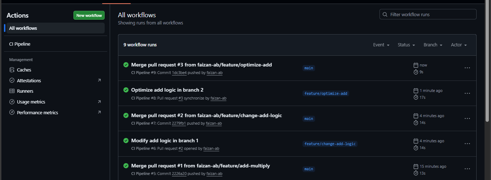
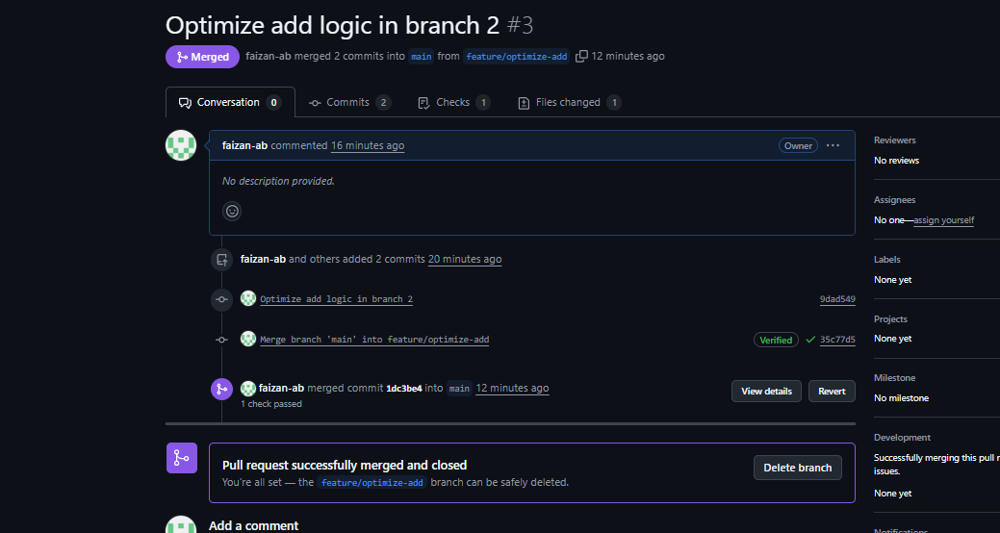

# 🚀 Git & GitHub CI/CD DevOps Project

## 📌 Project Overview
This project demonstrates a professional Git workflow using GitHub with automated CI validation. It simulates real-world DevOps practices including feature branching, pull requests, merge conflict resolution, automated testing, and version tagging.

---

## 🛠 Tools & Technologies
- Git (CLI)
- GitHub
- GitHub Actions (CI)
- Python
- Pytest

---

## 🏗 Project Structure
git-github-ci-project/
│
├── app/
│ ├── init.py
│ └── calculator.py
│
├── tests/
│ └── test_calculator.py
│
├── .github/workflows/
│ └── ci.yml
│
├── requirements.txt
└── README.md

---

## 🔄 Workflow Strategy

### ✅ Branching Model
- `main` → Stable production branch
- `feature/*` → Feature development branches

### ✅ Pull Request Process
1. Developer creates feature branch
2. Pushes changes
3. Opens Pull Request
4. GitHub Actions runs automated tests
5. If CI passes → Merge allowed

---

## ⚙️ CI/CD Pipeline

GitHub Actions workflow triggers on:

- Push to `main`
- Pull request targeting `main`

### CI Steps:
1. Checkout repository
2. Setup Python
3. Install dependencies
4. Run pytest
5. Validate build

This ensures no untested code reaches the main branch.

---

## 🧪 Automated Testing

Implemented unit testing using `pytest`:

- test_add()
- test_subtract()
- test_multiply()

All tests must pass before merge.

---

## 🔥 Merge Conflict Handling

Simulated real-world merge conflict by:

- Modifying same function in two branches
- Triggering conflict during merge
- Manually resolving conflict
- Re-validating with CI

This demonstrates practical Git conflict resolution skills.

---

## 🏷 Versioning & Release

- Created release tag: `v1.0`
- Marked stable production-ready version

---

## 🎯 Key DevOps Concepts Demonstrated

- Feature Branch Workflow
- Pull Request Validation
- Automated CI using GitHub Actions
- Python Packaging for CI environments
- Merge Conflict Resolution
- Version Tagging
- Release Management

---

## 📸 Project Demonstration

### CI Pipeline Success

### Pull Request Validation

### Merge Conflict Resolution

----

## 👨‍💻 Author
Faizan

